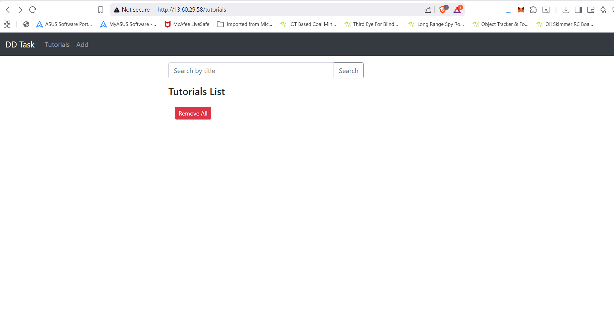
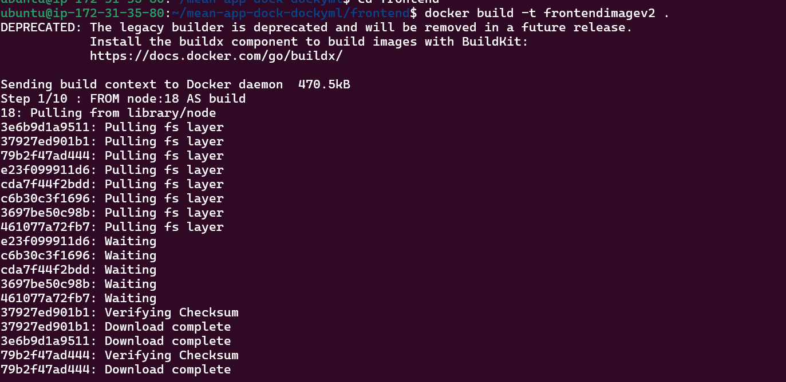
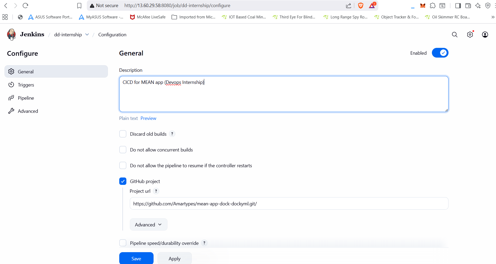
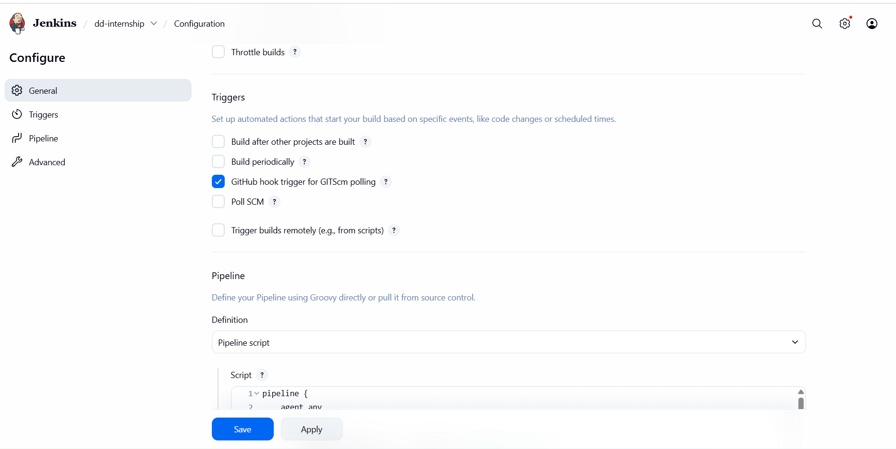
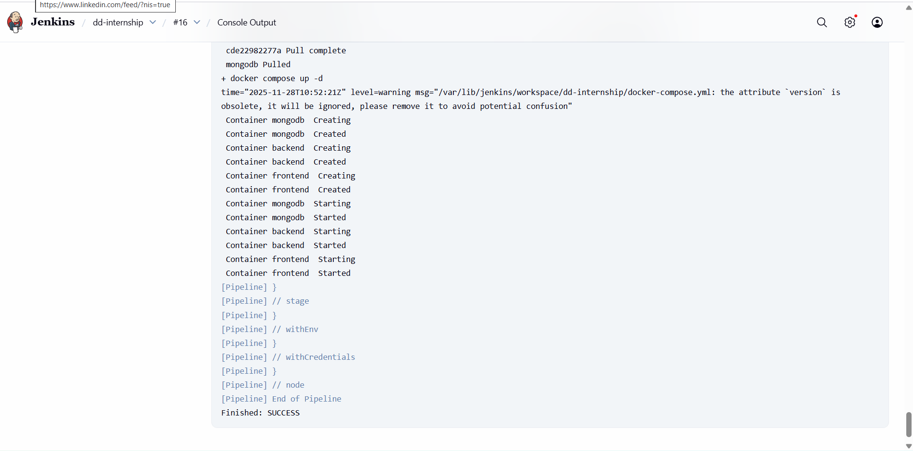

# MEAN Stack Application – Dockerized with CI/CD and NGINX Reverse Proxy



This project is a fully containerized **MEAN (MongoDB, Express, Angular, Node.js)** application, deployed using **Docker Compose**, automated through **Jenkins CI/CD**, and exposed securely using an **NGINX reverse proxy**.

---

##  **1. Repository Setup**
- A new GitHub repository was created to store the entire MEAN application.
- Folder structure:
  ```
  backend/
  frontend/
  docker-compose.yml
  Jenkinsfile
  ```

---

##  **2. Dockerization**

### Backend
- Backend updated to read the MongoDB URL from environment variables:
  ```js
  module.exports = {
    url: process.env.MONGO_URL || "mongodb://localhost:27017/dd_db"
  };
  ```
- Dockerfile created for the Node/Express server.
- Backend image built and tested locally.

### Frontend

- Angular project built using:
  ```
  ng build --prod
  ```
- Dockerfile created to serve built Angular files using NGINX.
- Frontend image built and tested locally.

---

##  **3. Local Container Network**
A custom Docker network was created:

```bash
docker network create appnet
```

MongoDB, backend, and frontend containers were attached to this network, allowing internal communication using service names.

---

##  **4. Running Application with Docker Compose**
A `docker-compose.yml` file was created containing services for:
- MongoDB (no host port exposed)
- Backend (exposed on host port `5000`)
- Frontend (no host port exposed, served via reverse proxy)
- Shared network `appnet`

The application was started using:

```bash
docker compose up -d
```

---

##  **5. Pushing Images to Docker Hub**
Both backend and frontend images were tagged and pushed:

```bash
docker tag <local-image> amardocks/<image-name>:latest
docker push amardocks/<image-name>:latest
```

---

##  **6. Verification**
Logs were checked to ensure:
- Backend successfully connected to MongoDB
- Angular UI was reachable
- API routes were working correctly

---

##  **7. Uploaded to GitHub**
After verifying Docker images and compose setup locally,  
the entire project (backend, frontend, Dockerfiles, docker-compose.yml) was **pushed to the GitHub repository**.

---

#  **8. Jenkins Installation on the VM**

After pushing to GitHub, Jenkins was installed on the same Ubuntu VM:

```bash
sudo apt update
sudo apt install openjdk-17-jdk -y
wget -q -O - https://pkg.jenkins.io/debian/jenkins.io.key | sudo apt-key add -
sudo sh -c 'echo deb https://pkg.jenkins.io/debian binary/ > /etc/apt/sources.list.d/jenkins.list'
sudo apt update
sudo apt install jenkins -y
sudo systemctl enable jenkins
sudo systemctl start jenkins
```

Jenkins was configured with:
- Docker installed and added to Jenkins user group
- A Docker Hub credential named **`dockerhub-creds`**
- A Pipeline project connected to the GitHub repo

---

#  **9. CI/CD Pipeline (Jenkinsfile)**

The pipeline performs:

### ✔ Checkout from GitHub  
### ✔ Build backend & frontend Docker images  
### ✔ Login to Docker Hub using Jenkins credentials  
### ✔ Push latest images to Docker Hub  
### ✔ Pull updated images on the VM  
### ✔ Restart containers via `docker compose up -d`  

This enables **automatic deployment on every Git push**.





---

#  **10. NGINX Reverse Proxy Setup**
NGINX was installed on the VM:

```bash
sudo apt install nginx -y
```

Because NGINX runs on the host and cannot resolve Docker service names,  
we retrieved container IPs:

```bash
docker inspect -f '{{range .NetworkSettings.Networks}}{{.IPAddress}}{{end}}' frontend
docker inspect -f '{{range .NetworkSettings.Networks}}{{.IPAddress}}{{end}}' backend
```

A reverse proxy was created at:

```
/etc/nginx/sites-available/meanapp
```

Example configuration:

```nginx
server {
    listen 80;
    server_name _;

    # FRONTEND (Angular)
    location / {
        proxy_pass http://<FRONTEND_CONTAINER_IP>:80;
    }

    # BACKEND (Node API)
    location /api/ {
        proxy_pass http://<BACKEND_CONTAINER_IP>:8080;
    }
}
```

Enabled using:

```bash
sudo ln -s /etc/nginx/sites-available/meanapp /etc/nginx/sites-enabled/
sudo nginx -t
sudo systemctl restart nginx
```

Now the entire application is accessible from:

```
http://<server-ip>/
```

---

#  **11. Application Live**

 
- Angular frontend served through NGINX on port **80**
- Backend API accessible through `/api`
- Automatic deployment via Jenkins on each Git push
- Docker images automatically versioned and pulled from Docker Hub

 
